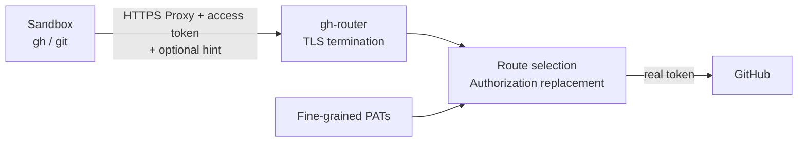

# gh-router 設計

- Status: Draft
- 対象: GitHub.com
- 最終更新: 2026-08-05

## 1. 概要

gh-router は、サンドボックスから GitHub への HTTPS 通信を仲介し、実際の Access Token を proxy 側で付与する Forward Proxy である。

最終的には、request の対象や操作を解釈して細かなポリシーを適用できる仕組みも考えられる。しかし最初からそこまで作り込まず、MVP では次に集中する。

- 実際の GitHub token をサンドボックスへ渡さない。
- 複数 owner 用の Fine-grained personal access token を proxy が使い分ける。
- `gh` と Git over HTTPS を、通常の使い方に近い形で動かす。
- client が持ち込んだ未知の token は GitHub へ転送しない。
- repository と操作の認可は、まず GitHub 上の token scope と permissions に任せる。

MVP に独自の policy engine は持たせない。proxy の route は「どの token を使うか」を決めるためのものであり、「その操作を許可するか」は選ばれた token の scope が決める。

この単純な形を実際の開発環境へ投入し、動かなかった `gh` command や不足した制御を観測してから、target extraction や proxy policy を追加する。

## 2. 最初の利用ケース

MVP は次の環境を対象とする。

- main repository には read/write 用の Fine-grained PAT を用意する。
- 関連する複数 owner の private repository には、owner ごとに read-only の Fine-grained PAT を用意する。
- public repository は、Fine-grained PAT に含まれる public read access を利用して参照する。
- main repository への write と、関連 repository/public repository からの read を同じサンドボックスから行う。
- 同じ proxy instance は、同じ credential set を利用してよいサンドボックス環境だけで共有する。

たとえば次の構成を想定する。

| 対象 | Credential | GitHub 側の scope |
| --- | --- | --- |
| `acme/main` | `main` | 対象 repository、必要な permissions は write |
| `acme-related/*` | `acme-related-read` | 必要な private repositories、permissions は read-only |
| `partner/*` | `partner-read` | 必要な private repositories、permissions は read-only |
| その他の public repository | 末尾の条件なし route が選ぶ credential | GitHub が全 Fine-grained PAT に与える public read |

main 以外の owner にも write が必要になった場合は、後述の credential hint を明示することで対応できる。ただし MVP の主要シナリオは「main のみ write、他 owner は read」とする。

## 3. MVP の範囲

### 対応する通信

- proxy 自身の `GET /ca.pem` による公開 CA 証明書の取得
- `api.github.com` の REST API と GraphQL API
- `github.com` の Git smart HTTP
- HTTPS remote を使う `git clone`、`fetch`、`pull`、`push`
- main repository に対する代表的な `gh repo`、`gh pr`、`gh issue` command
- 関連 private repository に対する代表的な read command

REST/GraphQL endpoint ごとの allowlist は作らない。選択された token が許可する API request はそのまま GitHub へ送る。

### MVP では扱わないもの

- SSH または `git://` による Git access
- Git LFS
- release asset の upload/download と CDN redirect
- `raw.githubusercontent.com`、`codeload.github.com` などの追加 host
- Packages、Gist、Codespaces、GitHub Pages、browser session
- GitHub App installation token の生成
- client ごとに異なる policy を持つ shared/multi-tenant proxy
- API operation や branch/ref 単位の独自認可

対応 host や command は、実践投入で必要性を確認してから追加する。

## 4. 全体構成



proxy は一つの process とし、MVP では内部 component を細かく分割しない。request ごとに次だけを行う。

1. 接続先が許可した GitHub host であることを確認する。
2. client の `Authorization` に正しい proxy access token が含まれることを確認する。
3. 任意の credential hint または request の owner/repository から credential を一つ選ぶ。
4. client の認証情報を破棄し、選択した実 token で `Authorization` を作り直す。
5. GitHub へ request を一度だけ転送する。

credential を選べない場合、または client が未知の token/Cookie を送った場合は GitHub へ転送しない。

## 5. 設定

設定として持つものは、listener/CA、proxy authentication、credential、route に絞る。対応 host は `api.github.com` と `github.com` に実装上固定し、設定には重複して持たせない。MVP は設定 parser の依存を増やさないため JSON を使用する。

```json
{
  "version": 1,
  "server": {
    "listen": "0.0.0.0:8080"
  },
  "authentication": {
    "tokenEnv": "GH_ROUTER_CLIENT_TOKEN"
  },
  "routing": {
    "routes": [
      {"when": {"repository": "acme/main"}, "credential": "main"},
      {"when": {"owner": "acme-related"}, "credential": "acme-related-read"},
      {"when": {"owner": "partner"}, "credential": "partner-read"},
      {"credential": "main"}
    ]
  },
  "credentials": [
    {"id": "main", "tokenEnv": "GH_ROUTER_TOKEN_MAIN", "hints": ["main"]},
    {"id": "acme-related-read", "tokenEnv": "GH_ROUTER_TOKEN_ACME_RELATED", "hints": ["acme-related"]},
    {"id": "partner-read", "tokenEnv": "GH_ROUTER_TOKEN_PARTNER", "hints": ["partner"]}
  ]
}
```

`server.caCertificate` と `server.caPrivateKey` を両方省略すると、起動時に
P-256 の CA 鍵と自己署名証明書をメモリ上で生成する。秘密鍵はファイルへ
書き出さず、公開 CA 証明書だけを proxy listener の `GET /ca.pem` で返す。
証明書の有効期間は 24 時間で、process を再起動すると新しい CA になる。

外部管理の CA を継続利用する場合は、従来どおり両方の path を指定する。
片方だけの指定は設定エラーとする。`GET /ca.pem` は生成 CA と外部管理 CA
のどちらでも、その process が実際に使用している公開 CA 証明書を返す。

`GH_ROUTER_TOKEN_*` は proxy process にだけ渡す。サンドボックスには渡さない。production の設定ファイルへ token value を直接書かない。

`authentication.tokenEnv` が指す値は GitHub credential とは別の proxy access token であり、proxy process と利用を許可する sandbox の双方に渡す。token 単体は自動 routing、`token:hint` は明示 routing として解釈する。`credentials[].hints` は秘匿情報ではなく、hint を持たない credential は明示選択できない。どの hint を選んでも、GitHub で実行できる範囲は対応する Fine-grained PAT の scope を超えない。

### 設定時の確認

- proxy access token は空、前後空白、`:` を許可せず、実 GitHub token と同じ値にしない。
- credential ID、hint、exact repository route、owner route は重複させない。
- route が参照する credential が存在することを起動時に確認する。
- 条件なし route は省略可能とし、定義する場合は一つだけ末尾に置く。
- main token は main repository だけを選択し、必要最小限の write permissions にする。
- related owner の token は必要な repository だけを選択し、read-only permissions にする。
- token には有効期限を設定し、rotation はまず手動運用とする。

route の定義は token scope と一致させるが、MVP では GitHub API を使った scope の自動検証は行わない。

## 6. Credential routing

### 6.1. 選択順序

credential は次の順で決める。

1. `Authorization` の Bearer/token 値または Basic password から proxy access token と任意の `:hint` を読む。
2. access token が無い、不正、または一致しなければ upstream へ送らず拒否する。
3. 既知の hint があれば対応する credential を選ぶ。未知の hint は拒否する。
4. hint が無ければ request から owner/repository を抽出する。
5. target ごとに route を上から評価し、最初に一致した route の credential を選ぶ。
6. 一致する route が無ければ `route_not_found` として拒否する。

credential hint は抽出結果より優先する。hint と実際の対象が合っていなくても proxy は独自認可を行わず、その token で GitHub へ送る。対象が token scope 外なら GitHub が拒否する。

route の `when.repository` は exact repository、`when.owner` は owner に一致する。条件の無い末尾 route はすべての target に一致し、target を抽出できない request にも使われる。repository と owner の優先順位は暗黙に持たず、設定上の順序で表す。

抽出結果が複数 credential を指して一意に決まらない場合は、条件なし route へまとめず `ambiguous_route` として拒否する。必要なら credential hint で明示する。

一度選択した token で `401`、`403`、`404` になっても別 token は試さない。特に mutation や Git push を自動 retry しない。

owner/repository 名は GitHub の扱いに合わせて case-insensitive に比較し、route lookup では lowercase の canonical form を使う。path の decode や `.git` suffix の除去に失敗した request は条件なし route へ流さず拒否する。

### 6.2. REST API

REST API では、代表的な path から routing target を抽出する。

| Path の例 | 抽出する target |
| --- | --- |
| `/repos/{owner}/{repo}/...` | exact repository と owner |
| `/orgs/{owner}/...` | owner |
| `/users/{owner}/...` | owner |

`/user`、`/search/...`、numeric ID だけの endpoint など、owner/repository を抽出できない request は条件なし route または credential hint を使う。

REST operation の read/write 分類や body の解釈は行わない。たとえば repository 作成や transfer が許可されるかは、選択された token の permissions に依存する。

### 6.3. GraphQL API

GraphQL は URL が常に `/graphql` であるため、MVP では JSON body から best-effort で routing target を探す。

- variables 内の `owner` と `repo`/`name` の組
- `repository(owner: ..., name: ...)` の literal
- `organization(login: ...)` または `user(login: ...)` の owner

GraphQL document 全体の意味や query/mutation の認可は行わない。通常の `gh` command で観測した形式だけを小さな extractor として追加する。

node ID しか含まない mutation など、対象を抽出できない request は条件なし route を使う。別 owner の token が必要な場合は credential hint を指定する。条件なし route が無ければ拒否する。

一つの request に異なる credential route の対象が混在し、hint も無い場合は拒否する。一つの GraphQL request に複数 token を付けたり、query を分割・再実行したりはしない。

### 6.4. Git over HTTPS

Git smart HTTP は次の path から repository を抽出する。

```text
/{owner}/{repo}.git/info/refs
/{owner}/{repo}.git/git-upload-pack
/{owner}/{repo}.git/git-receive-pack
```

read/write の独自判定はせず、upload-pack と receive-pack のどちらにも選択された token を付ける。read-only token で push した場合は GitHub が拒否する。

Git request も proxy access token を `Authorization` に先行送信する必要がある。repository path から route を選び、API では Bearer、Git では Basic auth として実 token を付与する。

## 7. Client setup

### 7.1. 一時 command sidecar

Linux と macOS では、一つの command の実行中だけ proxy を起動できる。

```sh
gh-router exec -config config.json -- gh repo view acme/main
```

executor は同じ binary を sidecar として子 process に起動し、proxy の準備完了を
pipe で待ってから自身を指定 command に `exec` する。process tree は次の形になる。

```text
起動元
└── command（executor と同じ PID）
    └── gh-router sidecar
```

この形により起動元から見える PID、終了 status、終了 signal は command 自身の
ものになる。sidecar は元の親 PID を監視し、command の終了後に proxy を停止する。

`exec` mode は `server.listen` を使わず、常に `127.0.0.1:0` へ bind する。
準備完了後、command の環境へ次を設定する。

```text
HTTPS_PROXY, HTTP_PROXY, https_proxy, http_proxy = 一時 proxy URL
NO_PROXY, no_proxy = 空
SSL_CERT_FILE = 一時公開 CA 証明書 path
GH_HOST = github.com
GH_TOKEN = proxy access token と任意の :hint
```

実 token を指す設定済み環境変数、同じ実 token value を持つ環境変数、および
既知の ambient GitHub token 環境変数は command の環境から除く。hint を明示
する場合は、設定済みの値だけを `-hint` に指定できる。

```sh
gh-router exec -config config.json -hint partner -- gh api graphql ...
```

sidecar が生成する CA private key は memory 内だけに保持する。`SSL_CERT_FILE`
が指す一時ファイルには公開 CA 証明書だけを書き、private key は書かない。
外部管理 CA の場合も既存 private key を読み込むだけで、一時領域へ複製しない。
一時公開証明書と directory は command 終了後に削除する。

この mode は信頼済み sandbox launcher を `exec` するためのものである。sandbox
は host loopback、一時公開 CA file、上記環境変数を利用できる一方、内部の
未信頼 command から host process や token source を参照できない必要がある。
同じ user の host process を自由に検査できる command に対しては、sidecar が
command の子であるため、この helper 単体では実 token を隔離できない。

`exec` mode は Git の `extraHeader` や credential helper を設定しない。Git
authentication が必要な環境では、sandbox launcher または Git 側で別途設定する。

### 7.2. 手動 setup

サンドボックスでは、薄い wrapper または起動時設定で次を渡す。

```sh
mkdir -p /run/gh-router
curl --fail --silent --show-error \
  --noproxy '*' \
  http://gh-router.internal:8080/ca.pem \
  --output /run/gh-router/ca.pem

export HTTPS_PROXY='http://gh-router.internal:8080'
export HTTP_PROXY="$HTTPS_PROXY"
export NO_PROXY=''

export SSL_CERT_FILE='/run/gh-router/ca.pem'
export GIT_SSL_CAINFO='/run/gh-router/ca.pem'

export GH_HOST='github.com'
export GH_TOKEN='proxy-access-token-from-a-secret-channel'

git config --global http.https://github.com/.extraHeader \
  "Authorization: Basic $(printf 'x-access-token:%s' "$GH_TOKEN" | base64 | tr -d '\n')"
```

生成 CA を使う場合は proxy の再起動後に必ず証明書を取得し直す。HTTP による
初期配布自体は相手を認証しないため、proxy の address とそこまでの通信を信頼
できる隔離 network で使う。これを保証できない環境では、認証済みの配布経路を
使うか、別の信頼できる経路で証明書を照合する。

通常は proxy access token だけを送り、target extraction と ordered route に任せる。対象を抽出できない command で credential を指定する場合は、実 token ではなく access token に hint を付ける。

```sh
GH_TOKEN='proxy-access-token-from-a-secret-channel:partner' gh api graphql ...
```

hint を選ぶ操作は通常の利用では不要にし、実践投入で extractor が対応できなかった command の回避策として残す。後でその command の routing pattern を proxy に追加できる。

Git remote は `https://github.com/OWNER/REPO.git` に統一する。SSH remote を使う既存 repository は、sandbox 構築時に HTTPS へ変換する。

`gh auth token` が返すのは proxy access token と任意の hint であり、実 GitHub token ではない。これは期待する挙動である。

## 8. MVP に含める安全策

MVP を小さくしても、token の漏洩や持ち込み token の利用に直結する処理は最初から含める。

### TLS と host

- `CONNECT` は実装が対応する GitHub host の port `443` だけ許可する。
- 平文 HTTP で受け付けるのは proxy 自身の `GET /ca.pem` だけとする。
- CONNECT authority、TLS SNI、HTTP Host が一致することを確認する。
- proxy の CA 秘密鍵は proxy 側だけに置き、サンドボックスには公開証明書だけを配布する。
- GitHub upstream の TLS certificate を通常どおり検証する。
- 実 token は `api.github.com` と、Git smart HTTP と確認できた `github.com` request にだけ付ける。
- `github.com` では対応する smart HTTP path 以外を拒否し、browser/web request として転送しない。
- redirect は proxy 内で自動追跡しない。MVP の host allowlist 外へ移る処理は失敗させる。

### Client authentication と credential isolation

- client の `Authorization` は必須とし、正しい proxy access token 単体または `token:hint` だけ許可する。
- `Bearer`/`token` 形式と、Git client が使う Basic auth の password 部分から同じ値を認識する。
- proxy access token は定時間比較し、実 GitHub token と同じ値の設定は起動時に拒否する。
- それ以外の `Authorization`、Cookie、URL userinfo、`access_token`/`client_secret` query parameter は拒否し、単に上書きして転送しない。
- upstream request の `Authorization` は client header を編集するのではなく、選択した token から作り直す。

これにより、proxy access token を持たない client の利用と、侵入者が自分の PAT を設定して自分の repository へ write することを防ぐ。認証済み client が既知の hint を選んでも、得られるのは設定済み PAT の scope だけである。attacker owner の public repository では public read しか持たないため、write は GitHub に拒否される。

### Secret と log

- 実 token を response、error、access log に含めない。
- `Authorization`、Cookie、proxy CA private key を debug log にも出さない。
- log は request ID、host、抽出した owner/repository、選択した credential ID、status 程度に留める。
- token value の prefix や長さに依存せず、opaque string として扱う。

### この方式の限界

- route は認可ではない。token scope が設定ミスで広ければ、その範囲は利用できてしまう。
- 許可された main repository へ secret を commit、Issue、PR comment として書くことは防がない。
- proxy access token を持つ全 sandbox は、設定された全 credential hint を選べるものとして token scope を設計する。
- proxy authentication は TLS 内側の request で行うため、CONNECT と TLS handshake 自体は認証より先に成立する。認証前の request に実 token を付けたり upstream へ転送したりはしないが、network-level の DoS 対策にはならない。
- request smuggling 対策、詳細な parser fuzzing、DLP などを独自実装するものではない。まず成熟した HTTP/TLS library を使い、公開範囲は隔離環境に限定する。
- proxy を経由しない GitHub/外部ネットワークへの通信は、別の egress 制御で遮断する必要がある。

## 9. 実践投入と確認項目

最初は test organization または影響を限定できる開発環境へ配置する。対応を protocol 名だけで判断せず、実際に使う `gh`/`git` command を acceptance test にする。

### 必須シナリオ

1. main repository を `git clone`、`fetch`、`push` できる。
2. main repository で `gh repo view`、`gh pr list/view/create`、`gh issue list/view/create` が動く。
3. `acme-related` と `partner` の private repository を clone/fetch できる。
4. 関連 private repository に `gh repo view`、`gh pr list/view` を実行できる。
5. read-only token を選んだ関連 repository への push/write が GitHub に拒否される。
6. route の無い public OSS repository を clone し、`gh repo view` で参照できる。
7. 対象を抽出できない GraphQL operation を credential hint で正しい token へ送れる。
8. client が独自 PAT、Cookie、URL userinfo を送ると、GitHub へ到達する前に拒否される。
9. attacker 管理 repository への write は、自動 route、条件なし route、各 hint のどれを使っても失敗する。

### 実装時の test

- route が設定順に評価され、先に置いた exact repository route が owner route より優先されること。
- proxy authentication、credential hint、target extraction、ordered route、reject の順序が固定されていること。
- GraphQL で複数 route が見つかった場合に拒否すること。
- fake upstream で client の token/Cookie が一 byte も転送されないこと。
- credential ごとに期待した Bearer/Basic header が付くこと。
- `401`/`403`/`404` の後に別 token を試さないこと。
- allowlist 外 host、CONNECT/SNI/Host 不一致を拒否すること。
- access log と error に token が含まれないこと。

投入後は `route_not_found`、`ambiguous_route`、条件なし route の使用回数と失敗した command を記録する。実際に必要になった pattern だけ extractor または route に追加する。

## 10. 将来の方向性

MVP の運用結果を基に、必要なものを個別に追加する。

- **Routing 改善**: よく使う REST path、GraphQL variables/literal、numeric/node ID の resolver を増やす。
- **Proxy policy**: token scope だけでは広すぎることが確認された操作に、repository/action 単位の deny/allow を追加する。
- **Credential provider**: GitHub App installation token、短命 token、secret store、rotation 自動化へ対応する。
- **Shared proxy**: 異なる権限の sandbox を同じ instance で扱う必要が出た場合に、複数の client credential と profile を追加する。
- **追加 protocol/host**: Git LFS、release asset、raw/codeload、Packages へ必要な範囲で対応する。
- **運用機能**: metrics、alert、config reload、HA、より強い parser validation を利用規模に合わせて追加する。
- **互換性管理**: 利用する `gh` version と command matrix を CI で継続確認する。

最終的に routing 条件や proxy policy が増えても、MVP の ordered first-match と末尾の条件なし route の意味は維持する。新しい条件は `when` の中へ追加し、policy は token scope だけでは防げない具体的な操作が見つかった時点で追加する。

## 11. 参考資料

- [Managing your personal access tokens - GitHub Docs](https://docs.github.com/en/authentication/keeping-your-account-and-data-secure/managing-your-personal-access-tokens): Fine-grained PAT の resource owner、repository access、public repository read
- [GitHub CLI environment variables](https://cli.github.com/manual/gh_help_environment): `GH_TOKEN`、`GH_HOST`、`GH_REPO`
- [Authenticating to the REST API - GitHub Docs](https://docs.github.com/en/rest/authentication/authenticating-to-the-rest-api): REST API の token authentication
- [Forming calls with GraphQL - GitHub Docs](https://docs.github.com/en/graphql/guides/forming-calls-with-graphql): GraphQL endpoint、variables、query/mutation
- [Git HTTP protocol](https://git-scm.com/docs/http-protocol): `info/refs`、`git-upload-pack`、`git-receive-pack`
